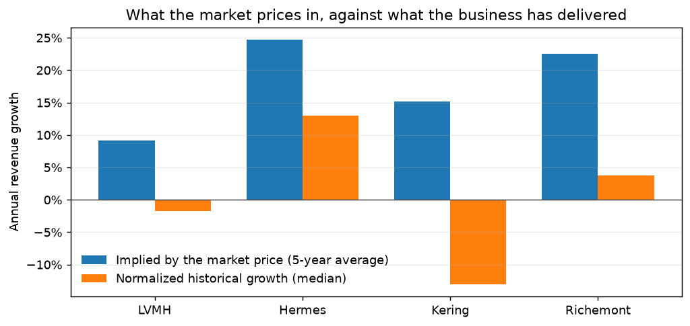

# valuation-lab

Discounted cash flow valuation of four European luxury houses, then inverted: what growth
does each share price already imply?




**In short**

- A reverse DCF finds that the share prices of LVMH, Hermès, Kering and Richemont imply 9–25% average revenue growth over five years, above each house's normalized history.
- The gap survives a WACC two points lower for Hermès (15.74% implied against 12.98% history) and Richemont (12.92% against 3.80%), not for LVMH or Kering.
- FCFF with leases treated consistently pre-IFRS 16, operating working capital charged on the change in revenue, capex pooled net of property disposals, WACC from a re-estimated beta.

Rendered report: <https://emiliensabathier.github.io/valuation-lab/>

## Results

Frozen data pull of 2026-08-07. Full report, with drivers, WACC bridge and sensitivity grids:
[`reports/valuation.html`](reports/valuation.html).

| Company | Price | Modelled value | Implied growth, yr 1 | Implied growth, 5y avg | Normalized growth | WACC | Implied exit |
| --- | --- | --- | --- | --- | --- | --- | --- |
| LVMH | 481.45 EUR | 328.82 EUR | 16.29% | 9.15% | -1.71% | 8.95% | 9.0x |
| Hermes | 1626.00 EUR | 901.63 EUR | 47.47% | 24.73% | 12.98% | 9.23% | 9.0x |
| Kering | 289.75 EUR | 84.94 EUR | 28.33% | 15.16% | -13.03% | 7.95% | 9.4x |
| Richemont | 196.15 CHF | 103.98 CHF | 43.01% | 22.50% | 3.80% | 9.42% | 9.9x |

The first implied-growth column is the front of a path that fades linearly to 2%; the second
is that path's average, and it is the number to compare with the company's own history.

**How to read it.** Every implied average sits above the normalized history, but the gap
measures the market against *this model*, and the model leans low (see Limitations): cash
flows are discounted at year-end, betas are raw and priced at a 5% equity risk premium, capex
still carries the property the houses kept, and four-year medians catch some houses in a
downturn. Re-solved at a WACC two points lower, the implied average drops to 1.08% (LVMH),
15.74% (Hermes), 4.78% (Kering) and 12.92% (Richemont). The defensible reading: the market prices more growth than these normalized
inputs credit, most clearly for Hermes and Richemont. It is not a claim that any share is
mispriced.

## Method

- **Free cash flow to the firm**: `EBIT x (1 - tax) + D&A + capex + lease payments - WC
  intensity x change in revenue`, five explicit years, Gordon terminal value at 2%.
- **Operating working capital**, not the cash-flow statement's working-capital line: inventory
  plus trade receivables less trade payables, as a median share of revenue (LVMH 22.43%, Hermes
  15.44%, Kering 17.46%, Richemont 41.14%, a jeweller's stock). It is charged on the change in
  revenue, so it costs cash only while the business grows, releases it when revenue falls, and
  grows with revenue in the terminal year, which keeps the Gordon step consistent.
- **Normalized drivers**: margin, tax, D&A, lease and working-capital ratios are medians
  across the reported years, not the latest value. Capex is pooled over the window net of
  property disposals (`Sale Of PPE`): property bought one year and sold back into a
  sale-and-leaseback the next is otherwise charged and never credited, and the rent on what was
  sold is already in the lease payment.
- **Leases, pre-IFRS 16, consistently**: the lease payment (last year's current lease
  liability plus after-tax lease interest) is charged in free cash flow; lease liabilities are
  excluded from net debt and from the WACC debt weight. Counting leases as debt *and* as a
  cash cost would count them twice; the companies' own net-debt definitions exclude them too.
- **WACC computed, not assumed**: CAPM on a beta recomputed from five years of weekly returns
  against the Euro Stoxx 50, cost of debt from reported interest, market-equity and book-debt
  weights.
- **Roll-forward to the price date**: cash flows are dated from the last fiscal year-end and
  discounted from the price date (0.59 years for the December filers, 0.34 for Richemont).
- **Reverse DCF**: Brent root-find on first-year growth over `dcf.value` itself; a round-trip
  test values at a known growth and requires the solver to recover it.
- **Terminal value restated as an exit multiple**, so "2% forever" can be judged as an EV/EBIT.
- **Currencies kept apart**: Richemont reports in EUR and trades in CHF; prices and the beta
  regression are converted, and the run refuses a missing rate.

## Limitations

- **Revenue growth is a median of three.** Four usable fiscal years give three growth rates;
  LVMH's -1.71% is literally its FY2023-to-FY2024 change.
- **Working capital counts trade payables only.** Accrued expenses and customer deposits are
  left out because the data does not separate operating from other payables, which overstates
  the intensity a little. The previous version charged the cash-flow statement's line as a share
  of the revenue level, which drained cash even at zero growth; moving to the operating build
  lifted value per share by 23.6% for LVMH, 17.5% for Kering, 13.1% for Richemont and 3.3% for
  Hermes.
- **Capex still carries property.** Kering's gross capex ran 5.26%, 13.34%, 19.61% and 5.66%
  of revenue over FY2022-FY2025: flagship real estate bought in the middle years, EUR 2.16bn of
  it sold in FY2025. Net of disposals and pooled, the model charges 7.69% (a median of the gross
  ratios would charge 9.50%). The buildings Kering kept are still
  charged as if they were recurring store spending; LVMH's FY2023 capex has the same shape.
- **Kering's 75% gap** is a normalization over a downturn: EBIT margin ran 26.12%, 23.48%,
  12.96%, 7.33%, so the 18.22% median sits above the latest year, while the -13.03% growth
  median is close to the latest rate. The report's Kering note is generated from these figures.
- **Lease payments are estimated.** The data has no lease-payment line; principal is the prior
  year's current lease liability (scheduled, not necessarily paid), and lease interest is
  reported interest split pro rata between leases and borrowings.
- **Discount-rate inputs are assumptions.** Risk-free 3%, ERP 5%, raw betas of 1.25-1.39 with
  no shrinkage toward one, year-end discounting. Kering's WACC is the lowest (7.95%) because its
  fallen market cap raises the book-debt weight to 25.15%, not because it is safer.
- **Hermes sits near the edge of the solver.** Its first-year implied growth (47.47%) is
  close to the 50% ceiling of `GROWTH_BRACKET`; a higher price would make the model refuse to
  publish rather than extrapolate. The ceiling is a plausibility limit, not derived.
- **The growth fade is linear**, a choice; a company defending a premium would argue convex.
- **No segment build, no sum-of-the-parts**, and terminal growth is not varied by company.
- **Frozen, not live.** A `--refresh` run reproduces the method, not these cents.

## Running it

```bash
python -m venv .venv
.venv/bin/pip install -e ".[dev]"      # Windows: .venv\Scripts\pip
.venv/bin/python -m vlab               # live fetch, writes reports/valuation.local.html
.venv/bin/python scripts/build_frozen_report.py   # committed page, from the frozen fixture
```

Statements and prices are cached under `cache/` for a week; `--refresh` forces a fetch.
After a methodology change, regenerate in order: `scripts/build_fixture.py
--expectations-only`, `scripts/build_frozen_report.py`, `scripts/build_readme_chart.py`.

## Tests

```bash
.venv/bin/python -m pytest --cov=src/vlab
```

143 tests, offline against injected fetchers, 98% coverage (`data/loader.py` at 89%: the
live-`yfinance` branches). The regression suite replays the frozen fixture and checks every
published figure, both sensitivity grids and the lower-WACC re-solve; a further test requires
the committed report to match a fresh render byte for byte. The full suite runs in under a
minute.

## Related

Companion studies, same approach: a frozen capture, a rendered report, stated limitations.

- [rates-lab](https://github.com/emiliensabathier/rates-lab) — what the yield curve prices: policy path, inflation, term premium
- [credit-lab](https://github.com/emiliensabathier/credit-lab) — which default score flags first, against real credit events
- [portfolio-lab](https://github.com/emiliensabathier/portfolio-lab) — whether any allocation rule beats a static 60/40
- [options-lab](https://github.com/emiliensabathier/options-lab) — what S&P 500 implied volatility prices: an arbitrage-free surface and the variance premium

## License

MIT.
